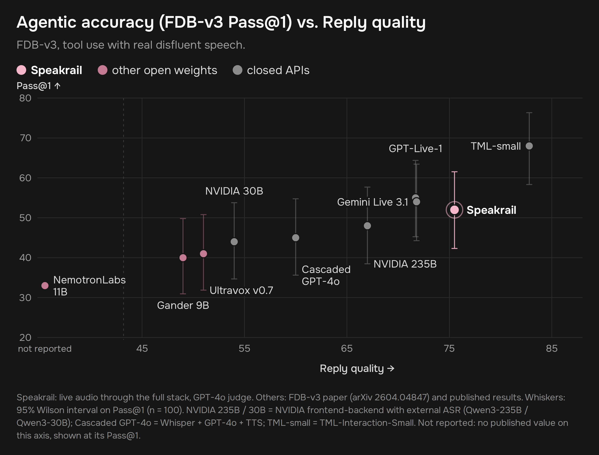
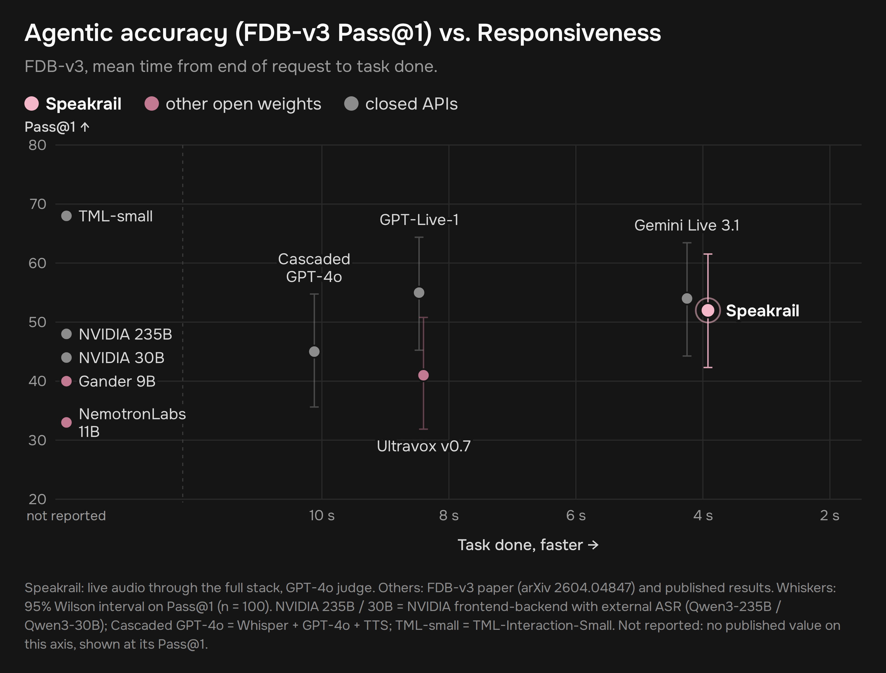
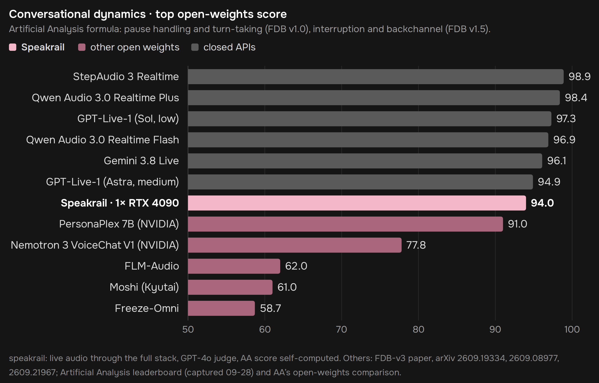

# Speakrail

A full-duplex voice assistant that runs on a single RTX 4090.

```bash
git clone https://github.com/speakrail/speakrail && cd speakrail && docker compose up -d
```

Then open **http://localhost:8080** and allow the microphone. Don't worry if it takes long to launch, the entire package is ~75 GB and it takes a long time to compile audio.cpp, prerender TTS cache and start vLLM.

https://github.com/user-attachments/assets/4d73f149-2d94-4bf6-b0a8-76be4b8a1840

Speakrail listens while it talks. You can interrupt it, say "mm-hmm" without stopping it, pause mid-sentence without being cut off, and ask it to count your reps while you keep talking. 

## How it works

```
mic ─► Voxtral Mini 4B Realtime (audio.cpp) + turn-taking head ─► words + "is the user done?" every 80 ms
                                                                         │
                       Gemma 4 12B + Speakrail LoRA ◄────────────────────┘
                       one decision per event: speak / listen / interrupt / yield / interject
                                   │
                                   ▼
                       Breeze TTS 2 ─► speaker
```

- **Turn-taking head:** a small head on Voxtral's hidden states tells, every 80 ms, whether you're speaking, finished, pausing mid-thought, or just backchanneling. [Model card](https://huggingface.co/speakrail/Voxtral-Mini-4B-Realtime-2602-TurnHead).
- **Turn-taking LLM:** Gemma 4 12B with a LoRA that reads your words as they arrive and makes every turn-taking decision itself, in one token per event (~60 ms). [Model card](https://huggingface.co/speakrail/gemma-4-12B-it-qat-Speakrail).
- **Peek and speculation:** when the head thinks you're done, the recognizer's last words are drained early and the reply starts before the turn is confirmed, so the answer is ready the moment you stop.
- **Listening notes:** while you talk, the base model takes notes on what you want, so long or corrected requests are answered correctly.
- **Tools:** weather, timers, notes, lists, calculator, unit conversion, optional web search and an optional larger model for hard questions.

## Results





### Conversational dynamics

Pause handling, turn-taking, interruptions and backchannels, scored with the Artificial Analysis formula on Full-Duplex-Bench v1.0 and v1.5: 94.0, the top open-weights score.



Latency on real recorded conversations: the reply reaches your ear about 0.7-0.8 s after your last word (median).

## Prerequisites

- RTX 4090 (or any other 24 GB NVIDIA card, it should work. If it doesn't - feel free to open an issue. I only have a 4090, so I couldn't test it on anything else.) The prebuilt images cover the RTX 3090 and 4090 generations. An RTX 5090 needs a build from source (see below).
- Linux with a recent NVIDIA driver
- Docker with Compose v2 and the [NVIDIA Container Toolkit](https://docs.nvidia.com/datacenter/cloud-native/container-toolkit/install-guide.html)
- About 75 GB of disk (models ~22 GB, container images ~50 GB)

## Installation

The one-liner above is all you need: every setting has a default. To change settings (port, voice, home city, web search), copy the example file first and edit it:

```bash
cp .env.example .env
docker compose up -d
```

The first start takes a while, about 20 minutes on a fast connection: about 22 GB of models are downloaded and verified, the services warm up, and short reply openers are pre-rendered in your voice. Later starts take a few minutes. `docker compose logs -f` shows the progress.

The containers come from Docker Hub: [speakrail/voxtral-stt-server](https://hub.docker.com/r/speakrail/voxtral-stt-server), [speakrail/breeze-tts-server](https://hub.docker.com/r/speakrail/breeze-tts-server), [speakrail/app](https://hub.docker.com/r/speakrail/app), [speakrail/model-init](https://hub.docker.com/r/speakrail/model-init), plus vLLM's official image. To build everything from source instead:

```bash
docker compose up -d --build
```

The speech recognizer is compiled for the RTX 3090 and 4090 generations by default; for an RTX 5090, set `ASR_CUDA_ARCHS=86;89;120` in `.env` before building.

Browsers allow the microphone only on `localhost` or over HTTPS. If Speakrail runs on another machine, use an SSH tunnel:

```bash
ssh -L 8080:localhost:8080 your-gpu-box
```

`http://localhost:8080/debug/` shows what the system sees and decides: turn-head probabilities, every decision, per-turn latencies.

## Configuration

Everything is in `.env` (see [.env.example](.env.example)):

| Setting | Default | |
|---|---|---|
| `UI_HOST` / `UI_PORT` | `127.0.0.1` / `8080` | where the web UI listens |
| `LLM_GPU_MEMORY_UTILIZATION` | `0.48` | lower it if the card also drives your display |
| `VOICE` | `female_a.wav` | a reference clip in `app/voices/` with its transcript next to it |
| `HOME_CITY` / `HOME_TIMEZONE` | London | "home" for the weather and time tools |
| `SILENCE_MS` | `1000` | silence that ends your turn when the head is unsure |
| `NOTES` | `1` | listening notes (better answers to long requests) |
| `TOOL_HOLD_MS` | `300` | tools run only after you've been quiet this long |
| `SEARCH` | `off` | `searxng` (local, start with `docker compose --profile search up -d`), `serper` or `brave` (API key) |
| `FIREWORKS_API_KEY` | empty | enables asking a larger model for hard questions (paid) |
| `SESSIONS_DIR` | off | save every session (log, context, audio) for debugging |

## Limitations

- English only.
- One conversation at a time.
- Echo cancellation comes from the client: browsers do it; a bare microphone and speaker on a device without it will hear the assistant as you.
- Following written-format instructions (word counts, markdown) is weaker than base Gemma: the model is tuned for short spoken answers.
- The default voice (Breeze TTS 2) is for research and non-commercial use only; see the license below.

## License

Speakrail's code is licensed under the [Apache License 2.0](LICENSE).

The models it downloads keep their own licenses (details in [NOTICE](NOTICE)):

- **Gemma 4 12B** (Google DeepMind): Apache 2.0
- **Voxtral Mini 4B Realtime** (Mistral AI): Apache 2.0
- **Breeze TTS 2** (BreezeBlue): code Apache 2.0; model weights and the audio they generate are for research and non-commercial use only. If you want to use speakrail commercially, you will have to swap that for another TTS. Any streaming TTS should work (in theory).

Speech recognition runs on [our fork of audio.cpp](https://github.com/speakrail/audio.cpp) (Apache 2.0, by [ShugoAI LLC](https://github.com/0xShug0/audio.cpp)), which adds the turn-taking head and peek decoding to its Voxtral realtime model. The voice runs on [our fork of Breeze TTS](https://github.com/speakrail/breeze-tts), which adds int8 serving next to an LLM on one card.

## Troubleshooting

**The UI doesn't open, or `docker compose ps` shows the app as `Created`:** the UI port is probably taken by another program. Pick a free port in `.env` (for example `UI_PORT=8085`), then recreate the app container:

```bash
docker compose up -d --force-recreate app
```

A container that failed to start on a busy port keeps a broken network setup, so a plain restart is not enough: it has to be recreated.
